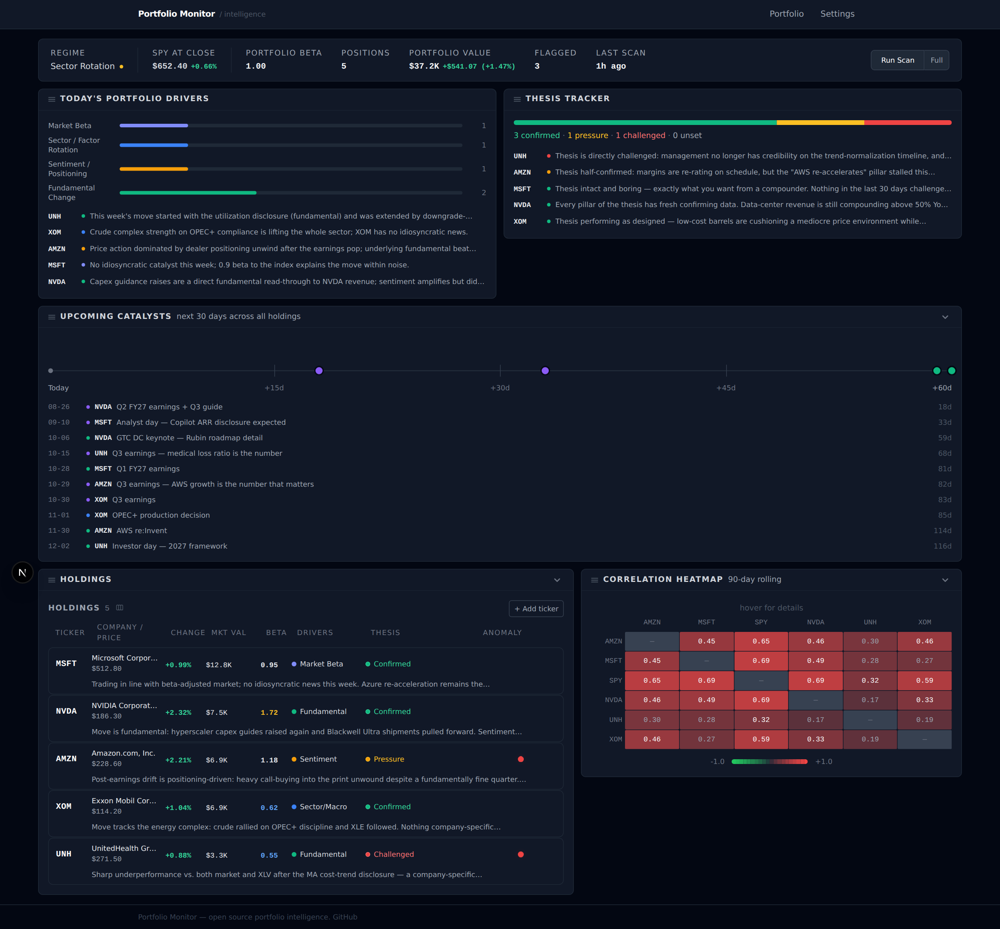
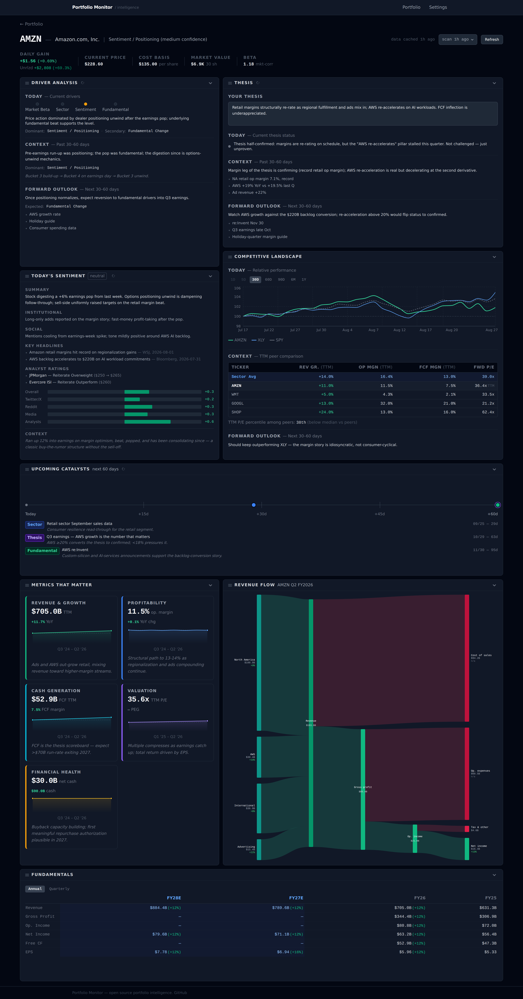

# AI Portfolio Monitor

**Why is this stock moving, is my thesis still right, and what's coming next?**

Portfolio Monitor is a local-first research tool for people who hold a handful of
stocks and want a structured second read on them. You bring your own positions and
your own API keys; everything runs on your machine and nothing is uploaded anywhere.



---

## The problem it solves

Most portfolio tools tell you *what* your positions did. The hard part is *why*, and
whether the reason should change your mind. Portfolio Monitor is built around six
questions:

**1. Is this move about the company, or about the market?**
Every holding's move gets attributed to one of four drivers, so you stop reacting to
beta as if it were news. This is the core abstraction — see
[How to read the output](#how-to-read-the-output).

**2. What is driving this stock — before, now, and next?**
Each company page separates the past 30–60 days, today's dominant driver, and the
expected driver over the next 30–60 days, so you can see when the story is changing
rather than only that it changed.

**3. What did I originally believe, and does it still hold?**
You write your thesis in plain language. Every scan re-reads it against new data and
marks it **confirmed**, **under pressure**, or **challenged**, with the specific
evidence that moved it. Your reasoning gets captured *before* the outcome is known,
which is the only real defense against rewriting history after the fact.

**4. What is sentiment actually saying?**
News, social, institutional flow, and sell-side actions are summarized separately
rather than mashed into one number — so "retail is euphoric but institutions are
trimming" survives as a readable signal.

**5. What am I about to be surprised by?**
A rolling catalyst calendar across every holding: earnings dates, product events,
macro decisions, and which of them are thesis-relevant.

**6. How correlated am I really?**
A rolling correlation heatmap, because "I own five things" and "I own one-and-a-half
bets" are very different portfolios.

Plus **anomaly flags** when a holding stops behaving the way the market regime says it
should, and **scan history** so you can look back at how the read on a position evolved
and when it stopped matching reality.

### What this is not

Not a screener, not a backtester, not a broker connection, and it does not produce
price targets or buy/sell calls. It is a structured way to re-read positions you
already hold. AI output can be wrong — verify anything you plan to act on.

---

## See it without any API keys

The fastest way to decide whether this is useful to you. No keys, no signup:

```bash
git clone https://github.com/kyledavidoff1-stack/portfolio-monitor.git
cd portfolio-monitor
npm install
npm run db:migrate   # create the local database
npm run seed:demo    # load a demo portfolio
npm run dev
```

Open [http://localhost:3000](http://localhost:3000). Every panel renders with a
five-holding demo portfolio — driver analysis, theses, sentiment, catalysts,
correlations, and financials.

> **`seed:demo` replaces the contents of your database.** If you are already tracking a
> real portfolio, point the demo at a separate file so your holdings and theses are
> untouched:
>
> ```bash
> DATABASE_URL=./data/demo.db npm run db:migrate
> DATABASE_URL=./data/demo.db npm run seed:demo
> DATABASE_URL=./data/demo.db npm run dev
> ```

**The demo numbers are invented**, including headlines and analyst actions attributed
to real publications and firms. It is a fixture for exploring the interface — not
research, and not something to pass off as real.

The seeded holdings come from [`examples/holdings.csv`](examples/holdings.csv), which
is also the format the importer accepts. Edit it and re-seed to change the demo, or
point the seeder at your own file:

```bash
HOLDINGS_CSV=./my-holdings.csv npm run seed:demo
```

---

## Use it with your own portfolio

### Step 1 — Requirements

- **Node.js 22 or newer.** The app itself runs on Node 18+, but the test runner needs
  22+, so 22 is the simpler target.
- npm.

### Step 2 — Get your two API keys

You bring your own keys. They are read from a local file and never leave your machine.

| Key | What it does | Where | Cost |
|-----|--------------|-------|------|
| **Financial Modeling Prep** | Prices, financial statements, company profiles, peers | [financialmodelingprep.com](https://financialmodelingprep.com/developer) | Free tier: 250 requests/day. Starter is $14/month. |
| **Anthropic (Claude)** | The eight-step analysis pipeline | [console.anthropic.com](https://console.anthropic.com) | Pay per use — see [Costs](#costs-and-limits). |

**On the AI key.** Pasting the key is all the setup there is — a current model is
picked for you. If you want a different model, or you would rather route through a
gateway or proxy that speaks the Anthropic Messages API, both are available under
**Advanced** on the Settings page. Three of the eight steps (news, catalysts, and the
regime check) ask the model to search the web using Anthropic's server-side search
tool; through a gateway those three work only if it translates that tool for its
backend, and if it doesn't they fail with a visible message while the other five run.

**What breaks without each key.** With no FMP key you can still run the app, add
holdings from a CSV, and read seeded data — but live quotes and fresh financials will
not load. With no Claude key everything renders except the AI analysis, and the scan
button will fail. The app is built to degrade rather than crash: missing data shows an
explicit empty state, and quotes fall back to the most recent cached daily close
(labelled as end-of-day rather than pretending to be live).

### Step 3 — Install and configure

```bash
git clone https://github.com/kyledavidoff1-stack/portfolio-monitor.git
cd portfolio-monitor
npm install
```

You can add your keys **in the app** — start it (steps 4 and 5), open **Settings**, paste
them in, and hit **Test connection** on each to confirm they work before you spend
anything on a scan. Keys entered there are stored in your local database.

If you would rather use a file:

```bash
cp .env.local.example .env.local
```

```bash
FMP_API_KEY=your_fmp_api_key_here
AI_API_KEY=your_anthropic_api_key_here
```

`.env.local` is gitignored. A key saved in Settings takes precedence over the file;
clear the field in Settings to fall back to it. Either way the keys stay on your
machine — in plain text, at the same trust level as any local dotfile.

### Step 4 — Create the database

```bash
npm run db:migrate
```

This creates `./data/portfolio.db`, a local SQLite file. There is no cloud component
and no account to create.

### Step 5 — Start the app

```bash
npm run dev
```

Open [http://localhost:3000](http://localhost:3000). If the port is taken, stop the
old process first: `kill $(lsof -ti:3000)`.

### Step 6 — Add your positions

Three ways, all under **Add ticker** in the Holdings panel:

- **Type a ticker.** Company name, sector, sector ETF, and beta are filled in from FMP.
  Shares and cost basis are optional but needed for P&L and portfolio-weighted beta.
- **Upload a CSV.** Header-aware; a plain broker export or a bare list of tickers both
  work. With no header row it assumes `ticker,shares,cost_basis`.
- **Seed from a file** with `HOLDINGS_CSV=./my-holdings.csv npm run seed:demo` if you
  would rather start from disk.

### Step 7 — Write a thesis for each holding

**Do this before your first scan.** The thesis is the input to the thesis-check step —
without one, that part of the analysis has nothing to work against and stays empty.

Click a holding to open its company page and write, in your own words, why you own it
and what has to be true for it to work. A few sentences is enough. Good theses are
falsifiable: *"AWS re-accelerates above 20% and retail margins hold above 6%"* gives
the scan something to check. *"Great company"* does not.

### Step 8 — Run your first scan

Hit **Full** on the dashboard. Budget a few minutes per holding on a first run — each
one runs six analysis steps, two of which search the web, and the whole portfolio then
gets a regime check and an anomaly pass. Later delta scans are much faster.

The scan runs server-side. You can navigate away, reload, or close the tab and it keeps
going; reopening the dashboard reconnects to the progress stream. Watch the progress bar
for per-ticker status.

### Step 9 — Read the results

See below.

---

## How to read the output

### The four drivers

Every holding's move is attributed to one primary driver (and optionally a secondary
one). This is the central idea of the tool — the same 3% drop means very different
things depending on which bucket it lands in.

| | Driver | What it means | What to do with it |
|---|---|---|---|
| 🟣 | **Market Beta** | The stock moved because the market moved. | Usually nothing. This is the noise you are trying to filter out. |
| 🔵 | **Sector / Factor Rotation** | The stock moved with its sector or a factor, not on its own news. | Watch if it persists — rotation can run for months. |
| 🟠 | **Sentiment / Positioning** | Flows, options positioning, or narrative — not fundamentals. | Often mean-reverts. Interesting when it diverges from fundamentals. |
| 🟢 | **Fundamental Change** | Something about the business actually changed. | This is the one that should move your thesis. |

Each classification comes with a confidence level and a written rationale, plus a
past / today / forward breakdown on the company page.

### Thesis status

- **Confirmed** — new data supports the thesis.
- **Under pressure** — one pillar is wobbling, the rest hold.
- **Challenged** — something material contradicts what you wrote.
- **Unset** — you have not written a thesis for this holding yet.

A *challenged* status is not a sell signal. It means the reason you gave for owning it
no longer matches the evidence, which is the moment to make a decision deliberately.

### When a step fails

A scan runs eight steps and any one of them can fail on its own — a rate limit, a
provider hiccup, a ticker the data provider does not cover. When that happens the scan
carries on and the rest of the analysis still lands, but the panel that step would have
filled shows an amber **"This step failed on the last scan"** banner with the underlying
error, and the scan progress bar lists which steps failed. Use the refresh button in the
panel header to retry just that step. An empty panel with no banner means the step ran
and genuinely found nothing.

### Regime and anomalies

The command strip shows the market regime — **risk-on**, **risk-off**, **rotation**, or
**dislocation** — as context for everything below it. An **anomaly flag** means a
holding diverged from what the regime and its beta would predict. That divergence is
usually the most information-dense thing on the page.



The company page adds sentiment broken out by source, a relative-performance chart
against the stock's sector ETF and SPY, TTM peer comparison, a revenue-flow diagram,
and the full financial statements.

---

## Day-to-day use

The dashboard has two scan buttons:

- **Run Scan** — a delta scan, and what you want most days. It re-runs only the steps
  whose cache has expired (news after 4h, catalysts after 12h, fundamentals, sector
  context, and thesis after 24h). Driver classification always re-runs because it reads
  today's tape. A price spike or an edited thesis also forces the relevant steps to
  re-run. Steps that are skipped carry their previous result *and* timestamp forward,
  so nothing looks fresher than it is.
- **Full** — forces every step for every holding, ignoring the cache.

Individual panels on the company page have their own refresh buttons for re-running a
single step. Past scans are browsable from the timestamp picker on the company page —
the AI analysis is historical while prices and financials stay current.

---

## Your data

Your portfolio lives only in `data/portfolio.db` on your machine. It is gitignored and
never leaves your computer. To keep a portable copy:

```bash
npm run export:holdings              # → ./my-holdings.csv
npm run export:holdings -- out.csv   # or name it yourself
```

This reads the database directly, so it works whether or not the app is running. The
same export is available in the app as **Export CSV** in the Holdings panel.

The export includes shares, cost basis, sector data, and your thesis text, and restores
through **Add ticker › Upload CSV**. Restoring works without an FMP key, because values
in the file are used directly and FMP is only consulted to fill gaps.

---

## Costs and limits

**FMP.** Quotes are fetched one ticker at a time, so a scan costs roughly one request
per holding plus history and fundamentals. On the free tier's 250 requests/day, a
10-holding portfolio scanned a couple of times a day is comfortable; more than that and
you will want the paid plan. Some tickers have thin FMP coverage and a few endpoints
are premium-only — those panels show empty states rather than failing.

**Claude.** Cost scales with holdings and scan frequency. A full scan of ten stocks is
roughly $0.50 at current pricing, and delta scans cost a fraction of that because only
expired steps re-run. Ballpark $10–30/month for a portfolio of 8–12 stocks scanned
daily. Treat these as estimates and watch your first month.

---

## Troubleshooting

**Styling looks broken on load in dev.** Hard refresh (`Cmd+Shift+R`). The `dev` script
already clears the server-side Next.js cache on every start.

**Port 3000 is in use.** `kill $(lsof -ti:3000)`.

**A panel is empty.** Either that holding has not been scanned yet, or the data
provider has nothing for the ticker. Company pages tell you which: a "Run scan to…"
prompt means it has not been analysed, an amber banner means the step failed and shows
why, and neither means the step ran and found nothing.

**`db:migrate` fails with "table already exists".** The database was created with
`db:push`, which does not record a migration history. Either keep using `db:push`, or
back up with `npm run export:holdings`, delete `data/portfolio.db`, run `db:migrate`,
and re-import. A database created with `db:migrate` from the start never hits this.

**A key saved in Settings is not being used.** Values in Settings take precedence over
`.env.local`, not the other way round. The Settings page labels each field with where
its current value came from.

**Prices show as end-of-day.** That is the intended fallback when live quotes are
unavailable — usually a rate limit or a free-tier restriction.

**Something in the AI output looks wrong.** It sometimes is. Every panel is a starting
point for your own work, not a conclusion.

---

## Architecture

```
Portfolio Monitor
├── Next.js App Router (frontend + API routes)
├── SQLite via Drizzle ORM (local data store)
├── Financial Modeling Prep API (structured financial data)
└── Claude API with web search (AI analysis pipeline)
```

**The analysis pipeline.** Six steps per stock:

1. News & sentiment scan (with web search)
2. Fundamental interpretation
3. Sector-relative context
4. Driver classification
5. Thesis check
6. Catalyst scan (with web search)

Then two portfolio-level steps: regime check and anomaly detection. Each step is
independently wrapped — a step that fails leaves its field empty and the rest of the
scan continues.

| Layer | Choice |
|-------|--------|
| Frontend | Next.js 15, App Router, TypeScript |
| Styling | Tailwind CSS |
| Charts | Recharts + D3 (Sankey) |
| Database | SQLite (better-sqlite3) |
| ORM | Drizzle |
| AI | Anthropic Claude API |
| Financial data | Financial Modeling Prep |

See [docs/architecture.md](docs/architecture.md) for the data model, the panel system,
the caching rules, and how to add a panel or a pipeline step.
[CHANGELOG.md](CHANGELOG.md) tracks what is built, what changed, and what is still open.

---

## Development

```bash
npm run dev         # clears .next cache, then starts on :3000
npm run build       # production build — also the type-check gate
npm test            # node:test suite (needs Node 22+)
npm run seed:demo   # reload demo data
```

Contributions welcome — see [docs/contributing.md](docs/contributing.md). Useful areas:
sector ETF mappings, prompt improvements, ticker coverage for symbols FMP handles
poorly, and a responsive pass (layouts currently assume a desktop viewport).

---

## Disclaimer

Portfolio Monitor is a research and monitoring tool, not investment advice. AI output
can be wrong or out of date, and market data may be delayed or incomplete. Verify
anything you plan to act on.

## License

[MIT](LICENSE)
